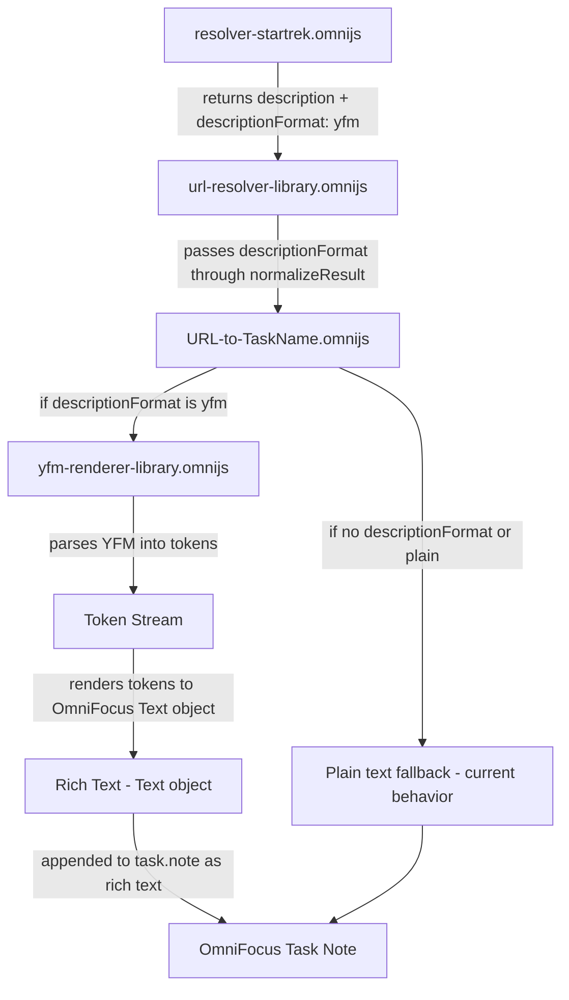
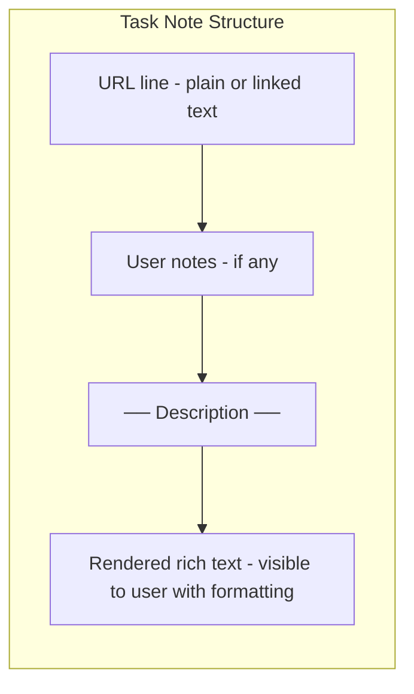

# Plan: YFM → Rich Text Rendering in OmniFocus Task Notes

## Problem

The StarTrek resolver (`resolver-startrek.omnijs`) returns issue descriptions in **YFM (Yandex Flavored Markdown)** format. Currently, this raw YFM text is stored as-is inside an HTML comment block in the task note, making it hard to read.

## Goal

Convert YFM descriptions to **rich text** using the OmniFocus `Text` API, so task notes display formatted content (bold, italic, links, headings, lists, code blocks, etc.) instead of raw markdown.

## Architecture



## OmniFocus Text API Summary

Based on https://omni-automation.com/omnifocus/text.html:

- **`task.note`** — Returns/accepts a `Text` object (rich text)
- **`new Text(string, style)`** — Create styled text
- **`text.append(string, style)`** — Append styled text
- **`Text.Style`** — Style attributes container
- **`Style.Attribute.Font`** — Font (use bold/italic variants)
- **`Style.Attribute.Link`** — Hyperlink URL
- **`style.set(attribute, value)`** — Set a style attribute
- **`text.attributeRuns`** — Access styled runs
- **`text.string`** — Plain text content

## Implementation Steps

### 1. Create `yfm-renderer-library.omnijs`

A new library plug-in with identifier `com.gmail.romansavrulin.yfm-renderer-library`.

**Responsibilities:**
- Parse YFM/Markdown text into an intermediate token stream
- Render tokens into an OmniFocus `Text` object with appropriate styling

**YFM constructs to support:**

| Construct | YFM Syntax | Rich Text Rendering |
|-----------|-----------|---------------------|
| Headings | `# H1`, `## H2`, etc. | Bold + larger font or ALL CAPS prefix |
| Bold | `**text**` | Bold font |
| Italic | `*text*` or `_text_` | Italic font |
| Bold+Italic | `***text***` | Bold italic font |
| Links | `[text](url)` | Text with Link attribute |
| Inline code | `` `code` `` | Monospace font |
| Code blocks | ` ```lang ... ``` ` | Monospace font, indented |
| Unordered lists | `- item` or `* item` | `• item` with indentation |
| Ordered lists | `1. item` | `1. item` with indentation |
| Blockquotes | `> text` | Italic + indented |
| Horizontal rule | `---` | `————————` separator |
| YFM Cut | `...` | Render title as bold, content below |
| YFM Note | `...` | Prefix with emoji: ℹ️/⚠️/❗ + content |
| YFM Tabs | `...` | Render each tab with header |
| Images | `` | `[Image: alt] (url)` as linked text |
| Tables | Markdown tables | Simplified plain text table |

**Parser approach:** Line-by-line + inline regex processing

```
1. Split input into lines
2. Process block-level constructs: headings, code blocks, lists, blockquotes, YFM blocks, tables, horizontal rules
3. For each text segment, process inline constructs: bold, italic, links, inline code, images
4. Build Text object by appending styled segments
```

### 2. Modify `resolver-startrek.omnijs`

Add `descriptionFormat: "yfm"` to the return value:

```javascript
return {
    title: key + ": " + issue.summary,
    description: issue.description || null,
    descriptionFormat: "yfm"
};
```

### 3. Modify `url-resolver-library.omnijs`

Update `normalizeResult()` to pass through `descriptionFormat`:

```javascript
function normalizeResult(raw) {
    // ... existing logic ...
    if (typeof raw === "object" && raw.title) {
        return {
            title: raw.title.trim(),
            description: raw.description || null,
            descriptionFormat: raw.descriptionFormat || null
        };
    }
    // ...
}
```

### 4. Modify `URL-to-TaskName.omnijs`

**Rich text only — no raw source storage**

Remove the HTML comment block approach entirely. Descriptions are rendered as visible rich text directly in the note. If a description needs to be updated, re-run the action to re-fetch from the API and re-render.

```
1. Load yfm-renderer-library
2. Remove setDescriptionBlock(), DESC_OPEN, DESC_CLOSE, DESC_REGEX constants
3. When result.description exists:
   a. If result.descriptionFormat === "yfm", use yfm-renderer to create a Text object
   b. Otherwise, create a plain Text object from the description string
4. Build the full task note as a Text object:
   - Existing note content (URL line, any user-added text)
   - ── Description ── separator line
   - Rendered description (rich text)
5. Set task.note to the composed Text object
```

**Re-resolution behavior:** When re-resolving a task that already has a description:
- Look for the `── Description ──` separator in the note text
- Everything from the separator onward is replaced with the new rendered description
- Content above the separator (URL, user notes) is preserved

### 5. Backward Compatibility

- Resolvers that don't return `descriptionFormat` will continue to work — their descriptions will be inserted as plain text
- The `descriptionFormat` field is optional throughout the chain
- Existing task notes with old HTML comment blocks: the old comment text will remain visible but won't interfere. Re-running the action will replace everything from the separator onward with the new rich text rendering
- Migration: optionally clean up old `<!--resolver:description-->` blocks when detected

## Note Structure Diagram



## File Changes Summary

| File | Change Type | Description |
|------|-------------|-------------|
| `yfm-renderer-library.omnijs` | **NEW** | YFM parser + OmniFocus Text renderer |
| `resolver-startrek.omnijs` | MODIFY | Add `descriptionFormat: "yfm"` to return |
| `url-resolver-library.omnijs` | MODIFY | Pass `descriptionFormat` through `normalizeResult` |
| `URL-to-TaskName.omnijs` | MODIFY | Remove comment block, add rich text rendering with separator-based replacement |

## Risks and Considerations

1. **Text API limitations** — The OmniFocus Text API may not support all formatting we want (e.g., nested lists, tables). We should gracefully degrade to plain text for unsupported constructs.

2. **Font availability** — Bold/italic/monospace fonts depend on system fonts. We should use system font families that are guaranteed to exist on macOS/iOS.

3. **Performance** — YFM parsing is regex-based and runs in JavaScriptCore. For very large descriptions, this should still be fast enough.

4. **YFM edge cases** — YFM has many constructs. We should start with the most common ones and add support incrementally.

5. **Re-resolution** — Since raw source is not stored, re-resolution always re-fetches from the API. This is acceptable since the API is the source of truth and descriptions may have been updated.

6. **Old comment blocks** — Existing notes with `<!--resolver:description-->` blocks will have that text visible. On re-resolution, the separator-based replacement will clean them up automatically if they appear after the separator.
